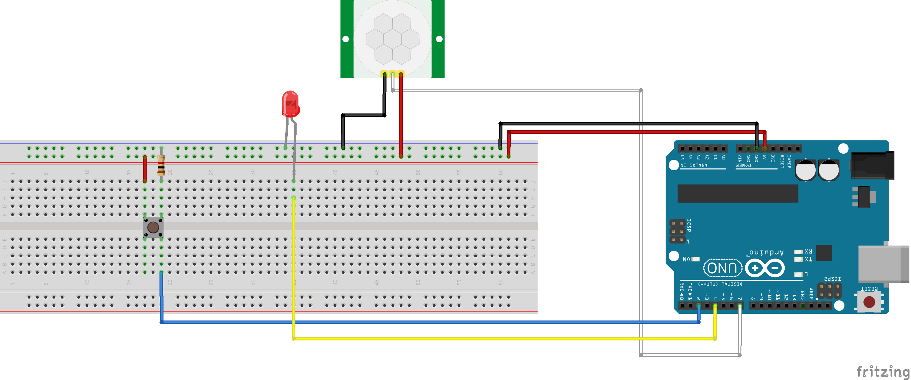
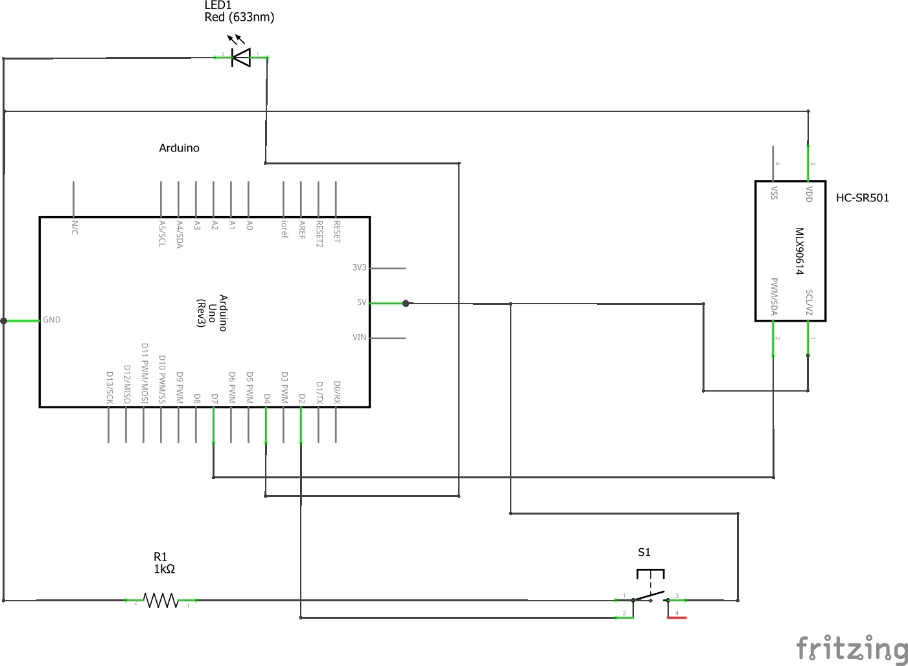

# Sistema de segurança

Sistema capaz de detetar movimento e enviar um email para o utilizador com o intuito de o avisar. 
Quando o utilizador provocar o movimento detetado ele pode carregar num botão para não receber email. 
Mesmo assim a informação desse movimento vai ser colocada no ThingSpeak.

## Usado na programação

* [Pyhon3.7.3](https://www.python.org/downloads/) - A linguagem usada para enviar email e colocar dados no [ThingSpeak](https://thingspeak.com/channels/797038).
* [Arduino IDE](https://www.arduino.cc/en/Main/Software) - Usado para controlar o arduino e o sensor de movimento.

## Circuito e esquematica

Circuito:

Esquematica:

## Authors

* **[Nil Silva](https://github.com/NilSilva)** - *1700774*
* **[Fernando Lopes](https://github.com/fernandojuniorlopes)** - *1700616*
